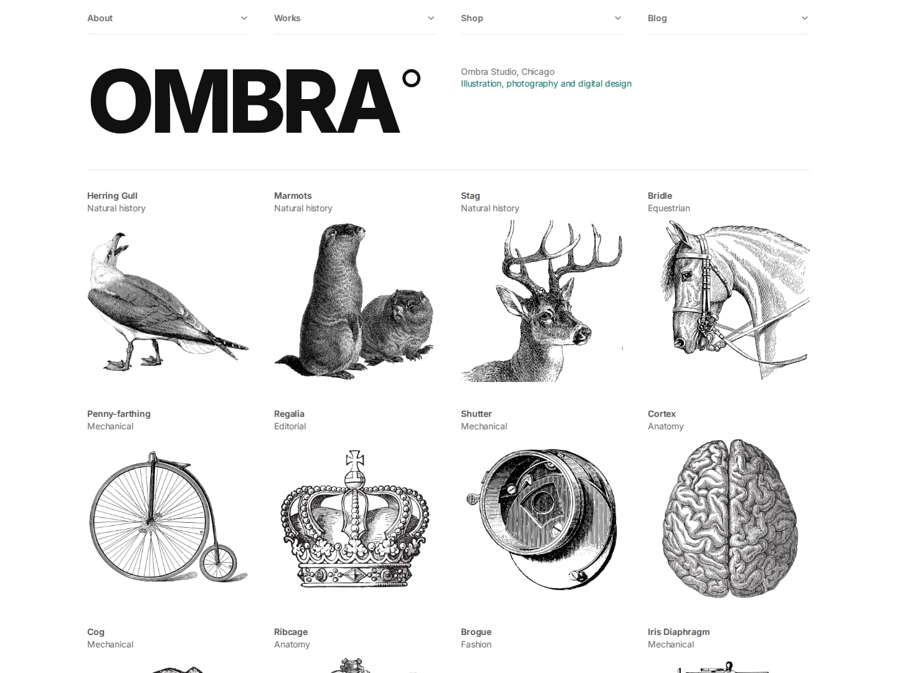
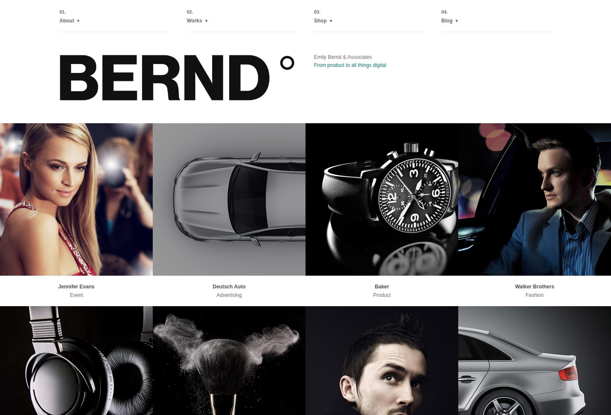
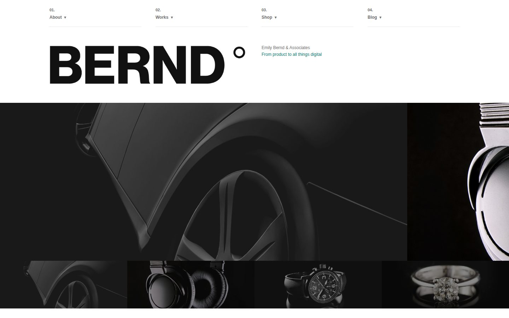
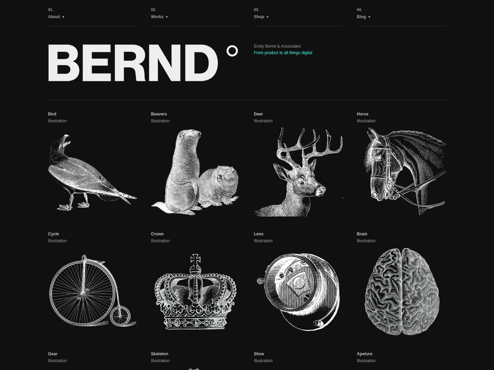
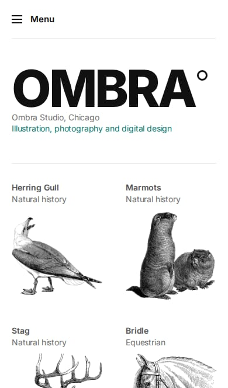
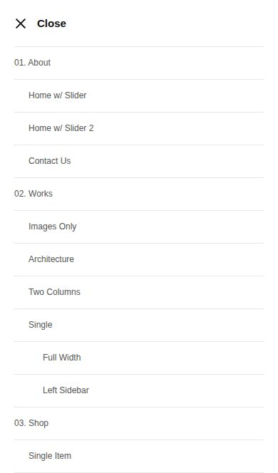

# Typefolio

A typography-led portfolio template for studios, designers and photographers.
Static HTML, CSS and one small JavaScript file. No build step, no framework,
nothing to install: open `index.html` and it works.

Originally released in 2013 and rebuilt in 2026 for current browsers.



## Screenshots

### Works grid



### Home page with carousel



### Dark mode

Follows the visitor's system setting. Line art is flipped so it stays legible
against a dark page.



### Phone

<p>
  
  
</p>

## Features

- **Fluid 12-column grid.** Percentage based, so the layout fills whatever
  width it is given. Class names (`.desktop-4`, `.tablet-6`, `.mobile-half`)
  are unchanged from earlier versions.
- **No dependencies.** One 10 KB script covers the menu and the sliders.
- **No third-party requests.** The web font is self-hosted; nothing phones home.
- **AVIF and WebP** for every image, with the original JPG/PNG as fallback.
- **A strict CSP** that needs no `unsafe-inline`, verified in a browser on
  every page.
- **Dark mode** via `prefers-color-scheme`, driven by CSS custom properties.
- **Accessible.** Keyboard-operable menu and sliders, visible focus, real form
  labels, AA contrast throughout. Zero axe-core violations on all 18 pages in
  both themes, at desktop and phone widths.
- **Respects `prefers-reduced-motion`.** Autoplay and smooth scrolling switch off.
- **18 page layouts:** three home pages, portfolio grids, project pages with
  optional sidebars, a shop, a journal and a contact page.

## Getting started

Download or clone, then open any `.html` file. To preview over HTTP:

```sh
python3 -m http.server 8000
# or
npx http-server -p 8000
```

Then edit the HTML directly. Each page is self-contained; there is no
templating layer, so the header and footer blocks are repeated. They are
byte-identical across pages, which makes a find-and-replace across all of them
safe.

## Deploying

There is no build step, so any static host works: upload the folder, or point
a host at the repository. Every path in the template is relative, so it runs
from a subdirectory as happily as from a domain root.

### GitHub Pages

This repository publishes to GitHub Pages, which is set up in `.github/workflows`:

| Workflow | Does |
| --- | --- |
| `pages.yml` | Publishes `main` to the site root, but only after `Checks` passes on that commit |
| `pr-preview.yml` | Publishes each pull request to `pr-<number>/` and removes it when the PR closes |
| `pr-preview-sweep.yml` | Weekly, deletes previews whose pull request is no longer open |

All three write to a `gh-pages` branch and share a concurrency group, so they
never race. `.github/scripts/assemble-site.sh` decides what ships: the HTML,
`css/`, `js/`, `fonts/` and `images/`, and nothing else.

To enable it: Settings → Pages → Source → Deploy from a branch → `gh-pages` / `root`.

**GitHub Pages cannot set response headers.** It serves a fixed
`cache-control: max-age=600` and no security headers, so `_headers` has no
effect there. The file is still worth keeping for the hosts below.

### Cloudflare Pages, Netlify

| Setting | Value |
| --- | --- |
| Framework preset | None |
| Build command | *(leave empty)* |
| Build output directory | `/` |

`_headers` is picked up automatically on both. It sets cache lifetimes and a
strict Content-Security-Policy, and both give preview URLs natively, so none
of the preview workflows above are needed.

### Cloudflare Workers

The newer Workers Builds flow needs a `wrangler.jsonc` declaring the assets
directory, and a `.assetsignore` so `tests/` and `node_modules/` are not
published. Note that its preview command is `npx wrangler versions upload`;
`wrangler preview` has not existed since Wrangler 2.

### Vercel

Translate `_headers` into a `vercel.json` `headers` array; the values carry
over unchanged.

## Tests

The template ships with no dependencies, but the repository has a test suite
for developing it. See [`tests/README.md`](tests/README.md).

```sh
npm install
npx playwright install chromium
npm test
```

It covers markup validity, the CSP, accessibility, the interactive behaviour
and rendering at eight widths in both themes. GitHub Actions runs it on every
pull request, and again against the published site after each deploy.

Point the suite at a deployed URL with `BASE_URL`:

```sh
BASE_URL=https://example.github.io/typefolio npm run test:behavior
```

Add `EXPECT_HEADERS=1` on a host that honours `_headers` to also assert the
declared headers are being served.

## Project structure

```
css/
  reset.css      element defaults and box-sizing
  typegrid.css   the fluid grid
  style.css      design tokens, components, page styles
js/
  typefolio.js   menu and slider
fonts/           self-hosted Roboto Slab (Apache 2.0)
images/          placeholder artwork, each in AVIF, WebP and the original
_headers         cache and security headers for Cloudflare Pages / Netlify
tests/           development only, see tests/README.md
docs/            screenshots used by this README
```

Nothing outside `css/`, `js/`, `fonts/`, `images/`, `_headers` and the HTML
files is served to a visitor.

## Customising

### Colours and type

Everything is a custom property at the top of `css/style.css`:

```css
:root {
  --color-accent: #22eedd;
  --color-accent-text: #097b72;  /* darkened, for small text on white */
  --color-text: #111;
  --font-sans: "Helvetica Neue", Helvetica, Arial, system-ui, sans-serif;
  --font-serif: "Roboto Slab", Georgia, "Times New Roman", serif;
}
```

There are two accent tokens on purpose. `--color-accent` is the bright cyan
used for fills, rules and underlines. `--color-accent-text` is a darkened
version for small text, because the bright cyan sits at 1.4:1 against white
and is unreadable at body size. If you change one, change both.

The dark palette is a second `:root` block under
`@media (prefers-color-scheme: dark)`. To ship light-only, delete that block.

### The grid

```html
<div class="container">
  <div class="desktop-8 tablet-12 columns"> ... </div>
  <div class="desktop-4 tablet-12 columns"> ... </div>
  <div class="clear"></div>
</div>
```

| Class | Applies |
| --- | --- |
| `.desktop-1` to `.desktop-12` | 768px and up |
| `.tablet-1` to `.tablet-12` | 768px to 959px, overriding `.desktop-*` |
| `.mobile-half`, `.mobile-one-third`, `.mobile-one-fourth`, `.mobile-one-fifth` | below 768px |
| `.offset-N`, `.push-N`, `.pull-N` | 768px and up |
| `.clear` | start a new row |
| `.hide-on-mobile`, `.show-on-mobile`, `.hide-on-tablet`, and so on | visibility |

Columns are full width below 768px unless a `.mobile-*` class says otherwise.

Every width is a percentage of the element's own container, so a grid nested
in a column counts against that column rather than the page. Mark the outer
column `.nested` to drop its padding, then number the columns inside it out of
twelve again: three equal cells inside a `.desktop-9` column are `.desktop-4`,
not `.desktop-3`.

```html
<div class="desktop-9 tablet-12 nested columns">
  <div class="desktop-4 tablet-4 mobile-half columns"> ... </div>
  <div class="desktop-4 tablet-4 mobile-half columns"> ... </div>
  <div class="desktop-4 tablet-4 mobile-half columns"> ... </div>
</div>
```

### Sliders

```html
<div class="tf-slider" data-slider data-slider-autoplay="6000">
  <div class="tf-slider__track" data-slider-track tabindex="0"
       role="group" aria-roledescription="carousel" aria-label="Featured work">
    <figure class="tf-slider__slide" data-slider-slide>
      
    </figure>
  </div>
  <button type="button" class="tf-slider__arrow" data-slider-prev aria-label="Previous slide">...</button>
  <button type="button" class="tf-slider__arrow" data-slider-next aria-label="Next slide">...</button>
  <div class="tf-slider__dots" data-slider-dots role="group" aria-label="Choose a slide"></div>
</div>
```

The track is a CSS scroll-snap container, so swipe, trackpad and arrow keys
work with no script at all. `js/typefolio.js` only keeps the buttons in step.

- Drop `data-slider-autoplay` to leave it still.
- Add `.is-peeking` to let neighbouring slides show at the edges.
- Set `--slide-ratio` (for example `.is-wide`) to match your artwork; the track
  height follows.
- Any element with `data-slider-goto="N"` becomes a control, which is how the
  thumbnail strip and the labelled project nav are built.

### The menu

Write the navigation once, as `<ul id="nav">`. Below 768px the script copies
it into a collapsible menu, so there is no second list to keep in sync. Add
`.hide-on-mobile` to an `<li>` to drop it from the narrow bar.

### Sticky sidebars

Add `.sticky` to a `.sidebar` inside a grid column. It holds position while
the main column scrolls, from 960px up, using `position: sticky`.

### Images

Every image ships in three formats. The browser takes the first it
understands, and the original is the fallback, so nothing breaks anywhere:

```html
<picture>
  <source srcset="images/thumb_item01.avif" type="image/avif">
  <source srcset="images/thumb_item01.webp" type="image/webp">
  
</picture>
```

`<picture>` is `display: contents` in the reset, so it generates no box and
every `img` rule in the stylesheet still applies exactly as it did before.

Keep `width` and `height` on the `img`: they reserve the space and stop the
page jumping as images load.

To regenerate the AVIF and WebP copies after replacing the artwork, any
encoder will do. With [sharp](https://sharp.pixelplumbing.com):

```js
await sharp(src).avif({ quality: 55, effort: 6 }).toFile(dest + '.avif');
await sharp(src).webp({ quality: 78, effort: 6 }).toFile(dest + '.webp');
```

`npm run test:markup` fails if an image is missing either sibling.

### Dark mode and images

Black line art on a transparent background disappears on a dark page. Add
`.invert-on-dark` to those images. Do not add it to photographs.

## Browser support

Chrome, Edge, Firefox and Safari, current and one version back. The template
uses `:has()`, `:focus-visible`, `aspect-ratio`, CSS custom properties and
scroll-snap, all of which have been baseline since 2023.

Internet Explorer is not supported. The IE-specific shims the old version
shipped had pointed at URLs that stopped resolving in 2016.

## What changed in the 2026 rebuild

The 2013 template no longer worked as shipped. On an HTTPS host, the CSS reset
was fetched over plain HTTP and blocked as mixed content, so pages rendered
without it.

**Removed, because it was broken or dead weight:**

| Gone | Why |
| --- | --- |
| YUI 3 reset from `yui.yahooapis.com` (HTTP) | Blocked as mixed content. Replaced by a local `reset.css`. |
| `ie7-js` and `html5shim` from `googlecode.com` | Google Code shut down in 2016. |
| jQuery 1.8 | 2012 release, pinned by two abandoned plugins. |
| `less-1.4.0.min.js` (79 KB) | Compiled LESS in the browser, with no LESS stylesheet to compile. |
| `modernizr.js`, `jQuery.BlackAndWhite`, `jquery.easing` | Loaded on every page, never called. |
| iosSlider, FlexSlider (50 KB) | Both abandoned. Replaced by CSS scroll-snap. |
| `typeSticky` | Cloned the sidebar and repositioned it on every scroll event. `position: sticky` does this natively. |
| Google Maps embed | Called the API with no key and `sensor=false`; it had thrown on load since 2016. Now a keyless OpenStreetMap embed. |

**Fixed:**

- Below 768px the container was pinned to 280px, so a modern phone showed a
  280px column with 55px of dead space either side. The grid is now fluid.
- `maximum-scale=1` in the viewport meta blocked pinch zoom.
- `outline: 0` on every link removed the only focus cue keyboard users had.
- Text greys `#aaa`, `#ccc` and `#ddd`, the `#22eedd` accent and white-on-cyan
  buttons all failed WCAG AA contrast.
- An unclosed `<a>` on the journal page produced four empty links.
- A stray `:` in a CSS rule silently dropped the block after it.
- The contact form's "10 + 6 = ?" captcha kept its answer in a hidden input two
  lines below the question.
- Unlabelled shop selects and quantity input.
- Every page shared one `<title>` and an empty meta description.
- Images had no dimensions, so every page shifted as they loaded.

**Added:** dark mode, self-hosted fonts, `prefers-reduced-motion` support,
lazy loading, Open Graph tags, a skip link, design tokens, AVIF and WebP
sources, a strict CSP, and a test suite wired into CI.

Scripts dropped from roughly 250 KB to 10 KB, and 5 external requests to 0.
Converting the artwork cut what a visitor downloads by a further two thirds:

| Page | Before | After |
| --- | ---: | ---: |
| Home | 3.7 MB | 1.4 MB |
| Works grid | 3.1 MB | 0.7 MB |
| Home with carousel | 1.6 MB | 0.2 MB |
| About | 272 KB | 160 KB |

## License

- Free to use in personal and commercial projects.
- Please do not resell it on template or theme markets.
- **The placeholder images are not yours to use.** They were bought from stock
  libraries (mostly Shutterstock) without extended licences. Replace every
  image in `images/` before you publish.
- Roboto Slab in `fonts/` is Apache 2.0. See `fonts/LICENSE.txt`.

## Author

Ye Joo Park. Questions to [subwaymatch@gmail.com](mailto:subwaymatch@gmail.com).
